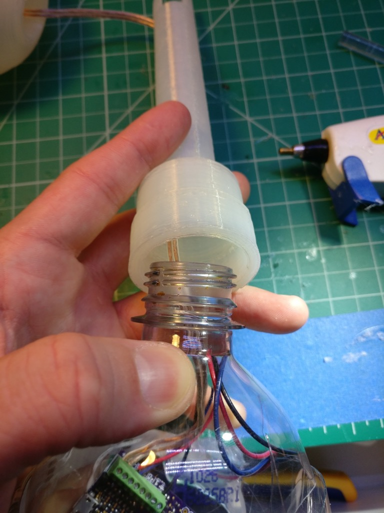
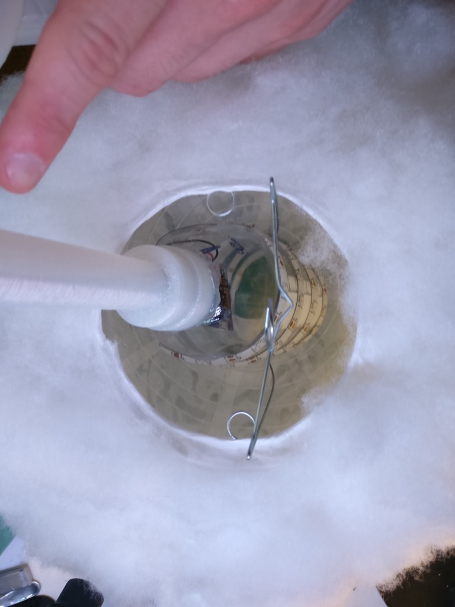

How to make a glow cloud
========================

.. author:: default
.. categories:: none
.. tags:: none
.. comments::

I made some glow clouds a few months ago, and people really loved them. I made another one today as a gift for a family member, and I decided it was time to share how I did it.

If you search for DIY glow clouds on the web, you'll find a ton of variety on how to do this. I'm going to show you how I do it, feel free to be creative and adapt for your needs (which is what I did).

Here's what we'll be making:

And with the LEDs off:

The 3D printed stand is optional - you can mount it however you want. I have several hanging from the ceiling in my bedroom. This one is designed to stand on a table or countertop.

Things you need
---------------

- Paper lantern. I use the 12 inch size in this build. If you're doing multicolor lighting, you want to get the white paper. You can find these on Amazon very cheaply.

- Hot glue gun.

- Plastic 32 oz bottle. Empty, obviously.

- Some LEDs. I'm using some leftover WS2812b LED strip. Mine have the silicone waterproofing, which as you'll see later will be useful. Something like a Hue light bulb could work too. Just don't use an incandescent bulb, or anything that gets hot! Glow clouds are extremely flammable!

- Some way to control your LEDs. For most, some kind of Arduino is the obvious choice here. I build my own controllers, so if you don't recognize the board I'm using, that's why. I'm assuming you have basic soldering and wiring tools, so I won't list those here.

- DC power jack. You can find these on Amazon. They have screw connections, which makes them indispensable for doing little projects like this.

- Power supply. Again, Amazon is your friend here. I'm using a cheap 5V 2A power supply. It's probably overkill for the 32 LEDs I have.

- The beverage of your choice. And music. You're making art, have fun with this!

Print the stand
---------------

You can get my stand design on Thingiverse here_.

.. _here: https://www.thingiverse.com/thing:2450697

I'm going to be honest with you, this is not the easiest print to do. It took me about five tries to get it to look good (and not fall apart). The orb at the top is particularly tricky. It's also going to take awhile. Mine runs about six hours with a 0.6 mm layer height (I'm using an E3D V6 Volcano). If you're using the more common 0.3 mm, it might take closer to a day. The design is in OpenSCAD, so feel free to tweak it. Good luck!

Here's a photo of the stand and the adapter part:

.. image:: 2017-07-20_glow_cloud_build/IMG_20170720_123601.jpg
    :width: 100%

Make the cloud
--------------

First, you want to assemble your paper lantern:

.. image:: 2017-07-20_glow_cloud_build/IMG_20170720_114025.jpg
    :width: 100%

The metal wire thingy goes in the paper thingy:

.. image:: 2017-07-20_glow_cloud_build/IMG_20170720_114135.jpg
    :width: 100%

Now you get out your glue gun and polyfill, and just really go to town on this thing:

I think doing about a handful at a time is most effective.

.. image:: 2017-07-20_glow_cloud_build/IMG_20170720_114348.jpg
    :width: 100%

After you get the center of your handful of fluff glued down, check the edges and make sure they are secure too. It doesn't need to be super strong, just enough so it's not going to peel off too easily.

Keep adding fluff...

.. image:: 2017-07-20_glow_cloud_build/IMG_20170720_114545.jpg
    :width: 100%

... until you have a full cloud:

Revel in your accomplishment, and then proceed to phase 2.

Mount the LEDs
--------------

First, we're going to wire up our LED strip. I've got some WS2812b laying around, so that's what I'm using. The fact that they only have three wires instead of the usual four makes the wiring easier. This is the 30 LED per meter density, and I've got 32 LEDs in the strip.

I'm using the silicone jacketed kind, so I need to get part of that off so I can get to the wiring contacts. If you're thinking of doing it like this:

Then STOP right now. Unless you are a black belt with a razor knife, you're going to cut through the copper and ruin your LED strip. Instead, take a small flathead screwdriver and wiggle it gently between the silicone and the LED strip, like so:

.. image:: 2017-07-20_glow_cloud_build/IMG_20170720_120600.jpg
    :width: 100%

You should be able to peel up the end and then tear it off by hand:

So much easier, and it's a lot harder to ruin your strip this way.

Now, attach your wiring to the LED strip. Six to eight inches will do. I recommend using flux and then pre-tinning the wiring and the pads on the strip before trying to solder them together. A little bit of preparation makes the overall process much smoother.

Ok, so next get your plastic bottle:

.. image:: 2017-07-20_glow_cloud_build/IMG_20170720_115827.jpg
    :width: 100%

And wrap your LED strip around it:

.. image:: 2017-07-20_glow_cloud_build/IMG_20170720_122214.jpg
    :width: 100%

The adhesive on most LED strip is terrible, so let's add some hot glue to make sure it stays put. I added glue in two places near both ends of the strip. This way, if the glue on the very end comes loose somehow, you've got another blob of glue an inch away, which hopefully will act as a backup. Note that the bottle will probably deform a bit from the heat.

.. image:: 2017-07-20_glow_cloud_build/IMG_20170720_123323.jpg
    :width: 100%

Now, get a razor blade, and cut three sides of a rectangle in the side of the bottle near the LED wiring. This is so we can cram the electronics on the inside of the bottle.

.. image:: 2017-07-20_glow_cloud_build/IMG_20170720_123505.jpg
    :width: 100%

This is ultimately what we're going for with the stand, adapter, and bottle (but don't glue these together yet!):

.. image:: 2017-07-20_glow_cloud_build/IMG_20170720_123657.jpg
    :width: 100%

Power wiring
------------

We need to run some wiring up the leg of the stand (the leg with the hole in it), and then out through the top, and finally through the adapter itself.

First, attach your wiring to the power jack. Again, tinning the leads is your friend here.

Now run the wiring up through the bottom of the leg, NOT through the hole!

Now finagle the power jack into the leg. This is a bit tricky with the support ring in the way, but it's doable.

I plugged in the DC end of the power supply (with the brick itself unplugged) to help prevent the jack from wandering off.

.. image:: 2017-07-20_glow_cloud_build/IMG_20170720_124952.jpg
    :width: 100%

Run the wiring out through the top of the stand and through the adapter, like so:

If you put the adapter into the stand, it will look like this:

Now is a good time to plug in the power supply and check the voltage on the wiring so you don't blow up your electronics, or realize your wiring is bad after you've glued everything together.

Connect the wiring to your electronics. Again, I make my own LED controllers, so your setup will probably look different here. Note the way the power wiring runs - through the neck of the bottle and then out through the rectangle flap we made.

.. image:: 2017-07-20_glow_cloud_build/IMG_20170720_125708.jpg
    :width: 100%

Now shove the electronics inside the bottle:

Very carefully hot glue the adapter to the neck of the bottle. Use as much glue as you can, this joint needs to be strong. Try real hard not to burn yourself while you do this, hot glue is HOT. You'll need to hold the adapter and bottle together for several minutes until the glue sets.

You should end up with something like this:

Great, now do the same thing with the power jack. Be gentle with the stand, the plastic will soften from the heat of the glue and you don't want to accidentally deform it.

.. image:: 2017-07-20_glow_cloud_build/IMG_20170720_130438.jpg
    :width: 100%

Now we something like this:

That's boring, let's turn it on:

.. image:: 2017-07-20_glow_cloud_build/IMG_20170720_131055.jpg
    :width: 100%

Good job, that looks pretty cool. Now its time to take a short break, and get another beverage.

Putting it all together
-----------------------

We're going to mount the bottle/LED assembly inside the cloud. First, pop off the metal wire thingy:

Very gently cram the bottle into the cloud. See how we're putting the bottle in between the metal wire thingy, that's why we want the silicone coated LED strip, otherwise you might end up with some short circuits.

Put the wire thingy back, and also check the top of the cloud to make sure everything is sitting correctly:

.. image:: 2017-07-20_glow_cloud_build/IMG_20170720_131552.jpg
    :width: 100%

Making sure the end of the bottle is pressed against the top of the cloud, tape the wire thingy to the adapter. It should be surprisingly stable.

Liberally coat the top of the cloud with hot glue to help secure the wire thing to the end of the bottle:

Let it cool a bit, then add more glue and another handful of fluff to complete the cloud:

.. image:: 2017-07-20_glow_cloud_build/IMG_20170720_132051.jpg
    :width: 100%

Awesome!

.. image:: 2017-07-20_glow_cloud_build/IMG_20170720_132519.jpg
    :width: 100%

Note that we don't glue the adapter into the stand. This way it comes apart in two pieces so it's easier to pack if you need to move it.

Fire it up
----------

.. image:: 2017-07-20_glow_cloud_build/IMG_20170720_132550.jpg
    :width: 100%

This is what the effect I use looks like:

.. raw:: html

    <iframe width="560" height="315" src="https://www.youtube.com/embed/ZCmPVnA20JQ?ecver=1" frameborder="0" allowfullscreen>
    </iframe>

Here's the code I used to generate the effect. It's written in a Python-based scripting language I made called FX Script. It's probably adaptable to FastLED or something like that, but you'll have to figure out how to do the smooth fades.

.. code-block:: python
    
    hue = Number()
    cursor = Number()

    def init():
        pixels.sat = 1.0
        pixels.val = 0.0
        pixels.hs_fade = 4000

    def loop():
        if rand() > 20000:
            return

        pixels.v_fade = 3000
        pixels.val = 0.0

        pixel = Number()
        pixel = rand(0, pixels.count)

        pixels[pixel].hue = hue
        pixels[pixel].v_fade = 100
        pixels[pixel].val = 1.0

        cursor += 1

        if cursor >= pixels.count:
            hue = rand()
            cursor = 0

Hopefully that gives you some ideas at least. Now, go forth and make some clouds!

